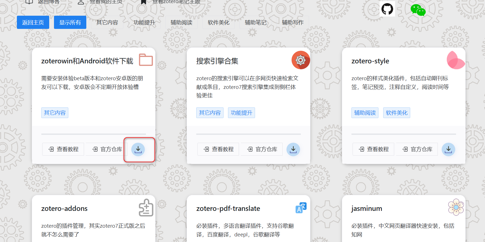
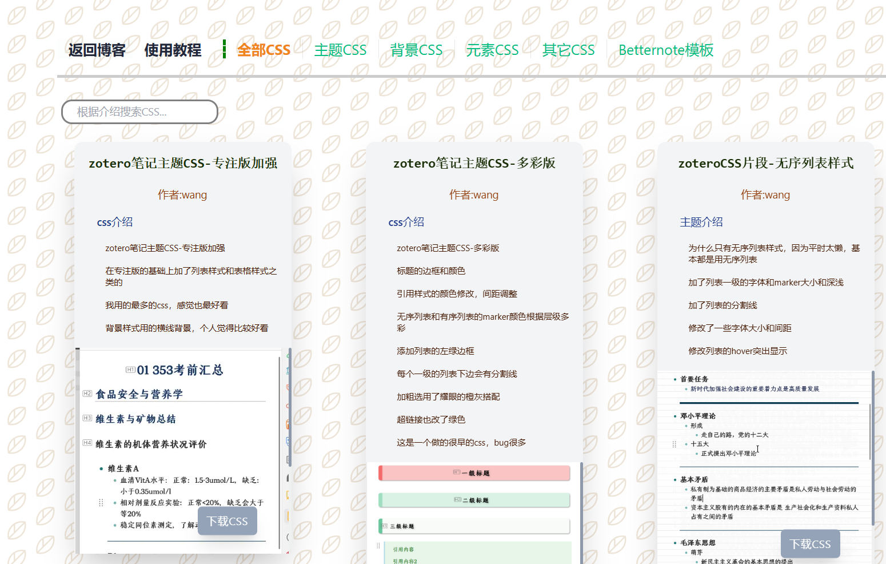

# zotero插件合集

## 包含内容

[网站链接](https://test.wk8686.top/)

- zotero常用插件
- zotero常用插件及收藏库
- 快速下载
- 教程快速跳转

## 插件安装

下载对应版本安装包，进入网页，点击下载，获取xpi文件

打开zotero进入  工具-附加组件-**Install Add-on From Files**-选择下载的xpi文件进行安装

## 网站截图

## 其它链接

[我的博客](https://www.wk8686.top)

[zotero笔记主题](https://zottheme.wk8686.top/)

